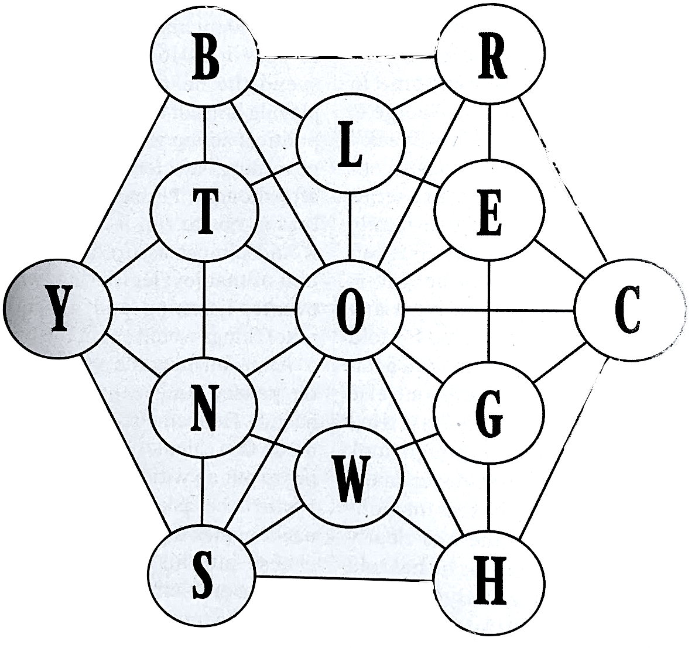

# puzzler 2020

given the following graph of allowed pairs of characters:



write a program that can read a dictionary file (e.g. `/usr/share/dict/words`) and print out only the words that are expressable on this graph. characters do not connect to themselves, while the letters and connections can be reused.

find and report the longest dictionary word expressed this way.

# solution: `python`
see `src/` folder. exploration with timing tests are in the `notebooks/` folder.

- simple quick fix.
- expresses graph as a dictionary, 
	+ each character is a key, 
	+ each key's value is a list of characters reachable from it.
- runs fast:
	+ if any character is not a key, word is discarded right away.
	+ uses python `set()` operations.
	+ only loads graph in memory once
	+ starts by reading entire input file into memory as opposed to read-check, tick-tock
 	
the main effort was in expressing the graph as a `dict`:

```
# given a letter, this dict lists the allowed letters that may follow:
next_letter_dict = {
    'b': ['r','l','o','t','y'],
    'r': ['c','e','o','l','b'],
    'c': ['h','g','o','e','r'],
    'h': ['s','w','o','g','c'],
    's': ['y','n','o','w','h'],
    'y': ['b','t','o','n','s'],
    't': ['b','l','o','n','y'],
    'l': ['r','e','o','t','b'],
    'e': ['r','c','g','o','l'],
    'g': ['e','c','h','w','o'],
    'w': ['o','g','h','s','n'],
    'n': ['t','o','w','s','y'],
    'o': ['b','r','c','h','s', 
          'y','l','e','g','w', 
          'n','t'],
}
allowed_tokens = set(next_letter_dict.keys())

```

the longest word found to be expressable with the given graph was 'horologer', and 'snowshoer' both of length 9. yay.
